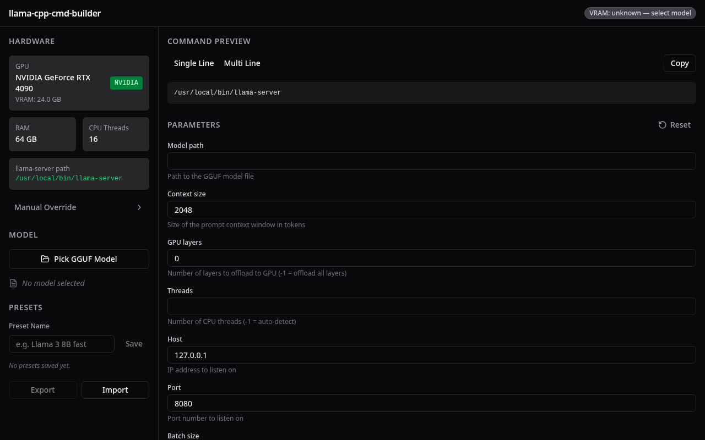
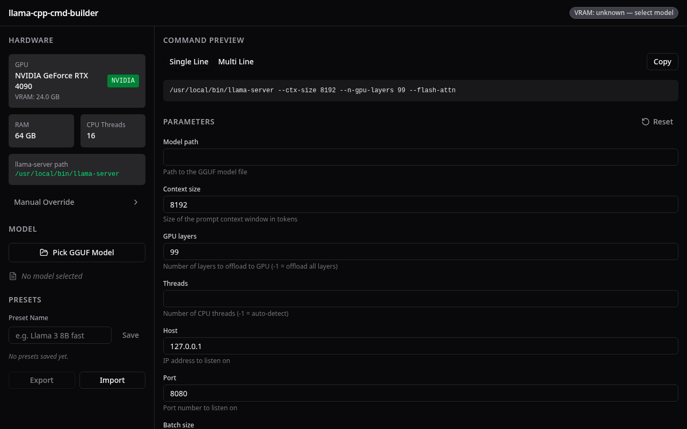
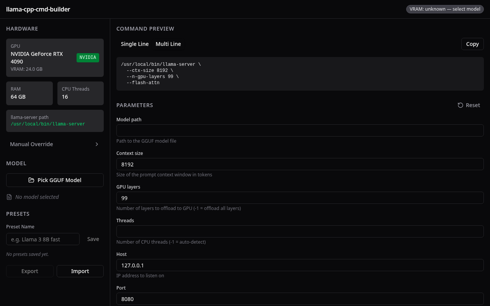
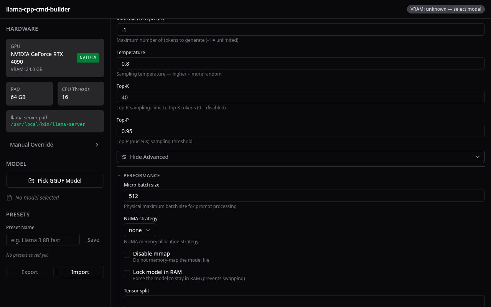

# Llama Wrangler

Electron desktop app for building `llama-server` (llama.cpp) launch commands without hand-crafting long flag strings.

## What it does

- **Auto-detects hardware** on startup: NVIDIA/AMD/Vulkan GPU, VRAM, RAM, CPU threads, llama-server binary path
- **Pick a GGUF model** via native file dialog — parses filename to infer size and quantization automatically
- **VRAM fit badge** shows estimated memory usage vs available VRAM (green/amber/red)
- **Live command preview** updates as you change params — copy to clipboard in one click
- **Curated params** cover the 15 most common flags; **Advanced toggle** exposes the full flag set grouped by category
- **Presets** save/load/delete named configurations per model; import/export as JSON

## Stack

Electron · React 19 · TypeScript · Vite (electron-vite) · TailwindCSS v4 · shadcn/ui · Zustand

## Screenshots

### Overview — hardware detected, ready to use


### Command building — params changed, live preview updates


*Single-line command: `/usr/local/bin/llama-server --ctx-size 8192 --n-gpu-layers 99 --flash-attn`*

### Multi-line format — readable backslash continuations for terminal pasting


### Advanced params — full flag set grouped by category (Performance shown)


## Running

```bash
bun install
bun run dev       # launch Electron app
bun run build     # production build
bun run test      # 47 unit + integration tests
```

E2E tests (requires display):
```bash
xvfb-run bun run test:e2e
```
